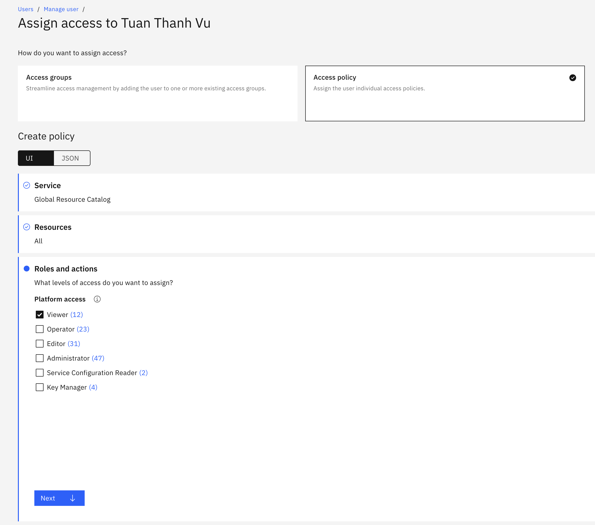

# FOCUS
Requirement: python3.10+

## Instructions:
- Execute the commands in ```env_var_template.sh``` and fill in the demanded information (Account ID, API Key, Billing month)
- Install required packages
```
pip install -r requirements.txt
```
- Run the billing script
```
python3 main.py
```

## Resources:
API references:
- accounts: /v1/accounts
- resource_usage_account: https://cloud.ibm.com/apidocs/metering-reporting
- resource_group: https://cloud.ibm.com/apidocs/resource-manager
- resource_controller: https://cloud.ibm.com/apidocs/resource-controller/resource-controller

| Focus field  | Optional | Value | Transformation | Explaination | Allows null |
|---------|-----|----------------|---------------|-----------|-------|
| Availability Zone | Yes | N/A | N/A || Yes |
| Billed Cost || resource_usage_account.usage.cost | Rename |
| Billing Account ID || resource_usage_account.account_id | Rename |
| Billing Account Name || accounts.name | Rename || Yes |
| Billing Currency || resource_usage_account.account_id | Rename |
| Billing Period End || First date of month | Generate
| Billing Period Start || Last date of month | Generate
| Charge Category || "Usage" | Fixed | Requires mapping to [Adjustment, Purchase, Tax, Usage]
| Charge Description || null | Fixed | N/A | Yes
| Charge Frequency || "Recurring" | Fixed | Requires mapping to [One-Time, Recurring, Usage-Based]
| Charge Period End || Last date of month | Generate | N/A
| Charge Period Start || First date of month | Generate | N/A
| Charge Subcategory || "On-Demand" | Fixed | Requires mapping depending on Charge Category: Usage:[On-Demand, Used Commitment, Unused Commitment], Adjustment:[Refund, Credit, Rounding Error, General Adjustment] | Yes |
| Commitment Discount Category || "Usage" | Fixed | Requires mapping to [Spend, Usage]| Yes |
| Commitment Discount ID || resource_usage_account.usage.discounts.ref | Rename || Yes |
| Commitment Discount Name || resource_usage_account.usage.discounts.name | Rename || Yes |
| Commitment Discount Type |Yes| N/A | N/A || Yes |
| Effective Cost || resource_usage_account.usage.cost | Rename |
| Invoice Issuer || "IBM" | Fixed
| List Cost || ListUnitPrice * PricingQuantity | Calculate |
| List Unit Price || if (resource_usage_account.resource.usage.price has 1 price): ListUnitPrice = resource_usage_account.resource.usage.price elif (resource_usage_account.resource.usage.quantity == 0): ListUnitPrice = 0 else: ListUnitPrice = ListCost/PricingQuantity | Calculate || Yes
| Pricing Category || "On-Demand" | Fixed | Requires mapping to [On-Demand, Dynamic, Commitment-Based, Other] || Yes |
| Pricing Quantity || resource_usage_account.usage.quantity | Rename || Yes |
| Pricing Unit || resource_usage_account.usage.unit | Rename || Yes |
| Provider || "IBM" | Fixed
| Publisher || "IBM" | Fixed
| Region || resource_usage_account.region | Rename || Yes |
| Resource ID || resource_usage_account.resource_instance_id | Rename || Yes | 
| Resource Name || resource_controller.resource_instance_detail.name | Rename | Yes |
| Resource Type || resource_controller.resource_instance_detail.type | Rename | Yes |
| Service Category || N/A | N/A | Requires mapping to [AI and Machine Learning, Analytics, Business Applications Compute, Databases, Developer Tools Multicloud, Identity, Integration, Internet of Things, Management and Governance, Media, Migration, Mobile, Networking, Security, Storage, Web, Other] |
| Service Name || account_summary.resource.resource_name
| SKU ID || N/A | N/A | N/A | Yes
| SKU Price ID || N/A | N/A | N/A | Yes
| Sub Account ID || resource_usage_account.resource_group_id | Rename |
| Sub Account Name || resource_group.resource_group_id.name | Rename |
| Tags || resource_usage_accounttags | List -> JSON || Yes
| Usage Quantity || resource_usage_account.usage.quantity | Rename || Yes
| Usage Unit  || resource_usage_account.usage.unit | Rename || Yes

## Required access
- billing.usage-report.read
- resource-controller.group.retrieve
- resource-controller.instance.retrieve

