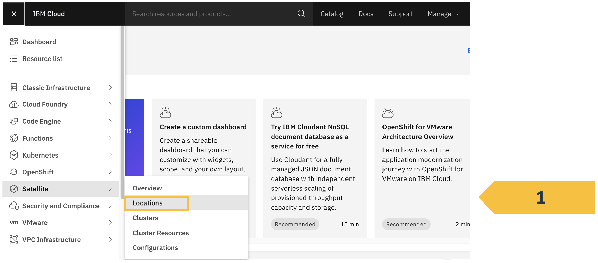
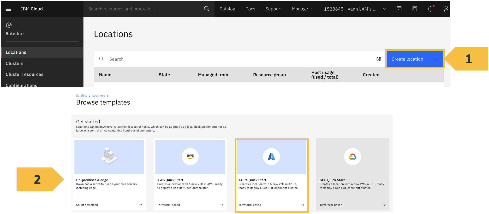

# IBM CLOUD


# Managed Redhat OpenShift by IBM Cloud on Azure using IBM Satellite

### Author : Vann Lam
#### Last update: 2022-05

## Introduction
In this document, we will be provisioning a ROKS cluster in an IBM Cloud satellite location hosted in an Azure account.
We will be using an IBM Cloud account and a Microsoft Azure account.

On Azure account, we will be provisioning VMs, using Terraform scripts in IBM Cloud Schematics when creating IBM Cloud Satellite location.

## Prereq on getting started on ROKS on Azure with IBM Cloud Satellite
1. You need to have an IBM Cloud account
2. You need to have a Microsoft Azure account
	(Azure Client ID, Azure tenant ID and Azure secret key) are 	sufficient
	
## Steps to get started on ROKS on Azure with IBM Cloud Satellite
1. Create an IBM Cloud location on Azure.
2. Deploy ROKS on the location
3. Create an image registry in ROKS to a COS bucket
4. Deploy Portworx on ROKS
5. Deploy ODF on ROKS

## Log in to IBM Cloud with IBMid on a web browser

&rarr; http://cloud.ibm.com


## Log in to IBM Cloud with CLI
### IBM Cloud CLI installation :
&rarr; https://cloud.ibm.com/docs/cli?topic=cli-install-ibmcloud-cli

### IBM Cloud CLI usage :

| Command line | Comment |
|------|-----|
| ibmcloud login | Use your IBMid credentials |
| ibmcloud login --apikey | Use your IBM Cloud Account apikey|
| ibmcloud login --sso | Use your enterprise credentials |

### Log in to Microsoft Azure with CLI
```
az login --service-principal
    -u < Azure Client ID > 
    -p < Azure key >
    --tenant < Azure tenant ID >
```


# Create an IBM Cloud Satellite location on Azure

## Go to Satellite Locations


## Create location on Azure


## Enter Azure credentials

