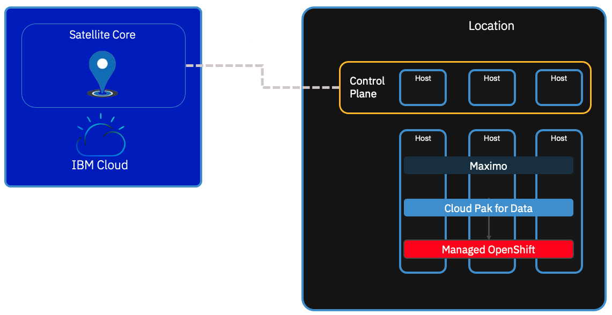

# IBM Cloud Satellite values
## Usecases
Here are the main values to propose IBM Cloud Satellite 
### Usecase 1 : Client has already chosen their cloud environment other than IBM Cloud

#### Painpoint :
Client has already their Cloud provider such as AWS or Azure or they still need to keep their IT on prem.
But their concern is to have a managed Openshift cluster supported by IBM Software

For instance, as of today (May 2022) IBM Maximo is validated and supported on IBM Cloud Satellite Openshift managed cluster, but not yet neither on AWS Rosa nor on Azure ARO.

Client needs to deploy IBM Software such as IBM Maximo rapidly and has no skills in Openshift.

Notes : Most of the IBM Software in IBM Catalog tend to be modernized, hence they are all Openshift based.

#### Proposed solution :

Client needs to understand that Openshift and IBM Software are still deployed on hardware and location of their choice.

"Location" in the above scheme represents any of the followings : Onprem, any CSP (AWS, Azure, GCP, ...).

In this example, the managed Openshift cluster is managed by IBM Cloud via the Satellite Core based in IBM Cloud.
On this managed Openshift Cluster, Client may install or may have installed IBM Software components that rely on Openshift such as CloudPaks and / or Maximo for instance.

Hence, client may have their IBM Sowftware installed on hardware and location of their choice. Reducing latency with their IT environments and thus no performance compromised.

### Usecase 2 : Client wants to benefit from Openshift Entitlement when purchasing IBM Software such as Maximo

#### Painpoint :
IBM Software based on Openshift are usually entlitled with Openshift subscription. Managed Openshift (ARO) on Azure and (ROSA) on AWS have also Openshift subscription entlitled.
Client seems to be charged Openshift Subscription twice.

#### Using Openshift subscription on IBM Satellite :
With IBM Satellite, Openshift subscription may be removed as long as the IBM Software installed on it has already an Openshift subscription.
Hence, usually using the same sizings of clusters, Managed Openshift IBM Cloud Satellite solution is cheaper than ARO and ROSA.

