# Secure your connection with IBM Cloud Satellite Connector

Author : Vann LAM,
Created on : May 16th 2024,
Updated on : May 19th 2024

Usecase 1 : Use IBM Cloud Satellite Connector to secure your API call from your **APIC Reserved Instance on IBM Cloud**

## What is IBM Cloud Satellite Connector ?

A Satellite Connector is a deployment model that enables the secure communications from IBM Cloud to on-prem resources with a light-weight container that is deployed on your container platform hosts, such as Docker hosts.

All details regarding IBM Cloud Satellite architecture can be found [here](https://cloud.ibm.com/docs/satellite?topic=satellite-understand-connectors) .

## General architecture

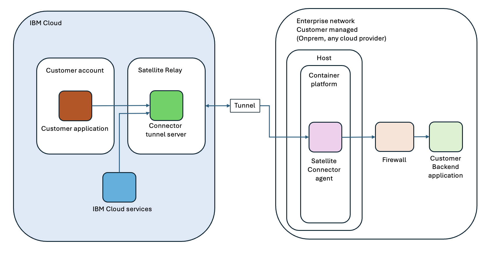

The key thing is that any IBM Cloud account with VRF and Service Endpoint enabled may reach all cloud service endpoints exposed by any IBM cloud service, especially those which are exposed by the Satellite Relay.

The Satellite Connector Agent is a simple docker image, which may be deployed by the client anywhere, on a docker based platform (docker, k8s, openshift, ...), is a kind of reverse ssh tunnel.

The Satellite Connector Agent prerequisites are :

- have internet access

- have access to the target backend application

When the Satellite Connector agent is configured and deployed correctly, it creates a secure tunnel (called a connector) to the Satellite Relay on IBM Cloud.

You may then create a Satellite Connector User Endpoint, which generates a new cloud service endpoint port which is reacheable by default by all IBM Cloud resources in any IBM Cloud account. This particular endpoint is related to a single Satellite Connector Agent deployed and enabled. This latter has the IP or FQDN and port number to target a specific backend application.

In order to secure the access of the cloud service endpoint from a particular client, you may setup an access control list to allow only specific client applications

## Create a Satellite Connector using the IBM Cloud console
Access to the menu Connector menu

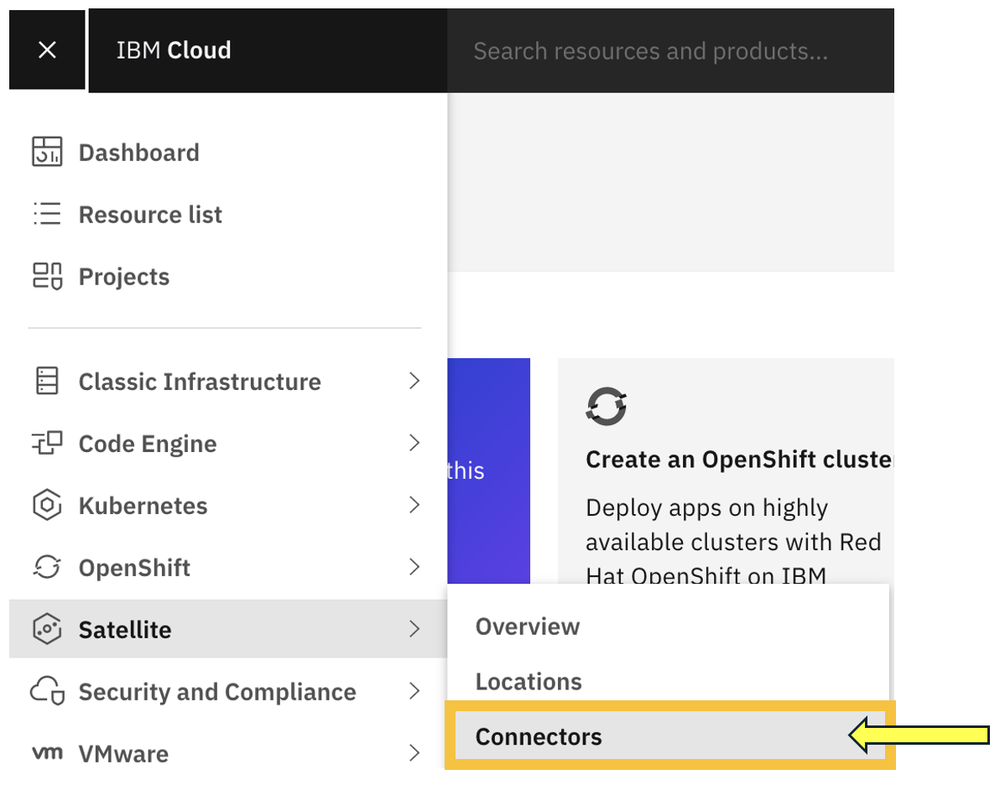

Create the connector

- Click 'Create connector'

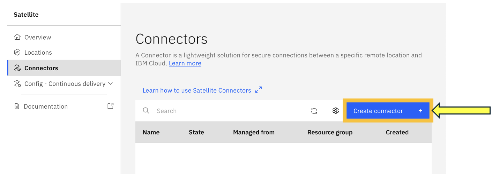

- Input the connector parameters

- Check that your connector is up and running
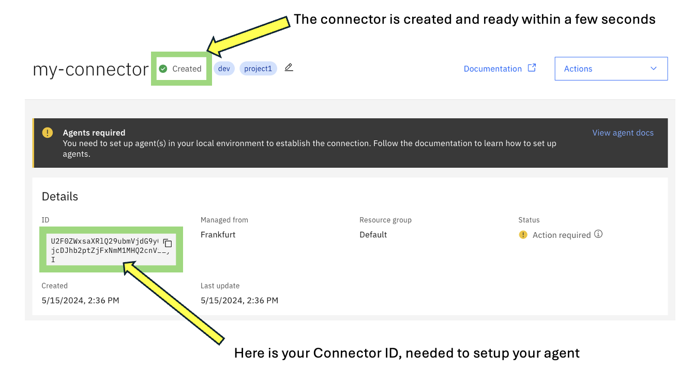

## Create the Satellite Connector Agent 

- The connector agent is not a resource being provisioned at the console level.
- See documentation [here](https://cloud.ibm.com/docs/satellite?topic=satellite-run-agent-locally&interface=ui).

When the container is running at the client site and correctly setup with the right parameters, especially :

- SATELLITE\_CONNECTOR\_ID : ID of the connector shown previously

- SATELLITE\_CONNECTOR_IAM\_APIKEY : APIKEY available in order to give the ability to the connector to connect to the client's IBM Cloud account

- SATELLITE\_CONNECTOR\_TAGS (optional) : this tag will appear at the console level

the agent will appear at the console level
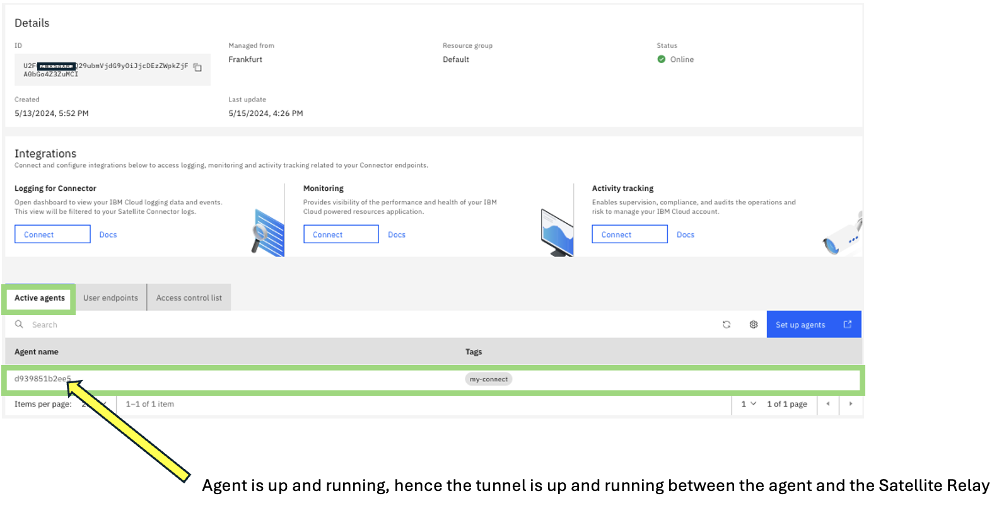

Note that the tag will appear accordingly in order to recognize the right agent

## Create the Satellite Connector User Endpoints

- The user endpoint will appear at all IBM cloud accounts with VRF and Service Endpoint option enabled, you need to input some parameters :
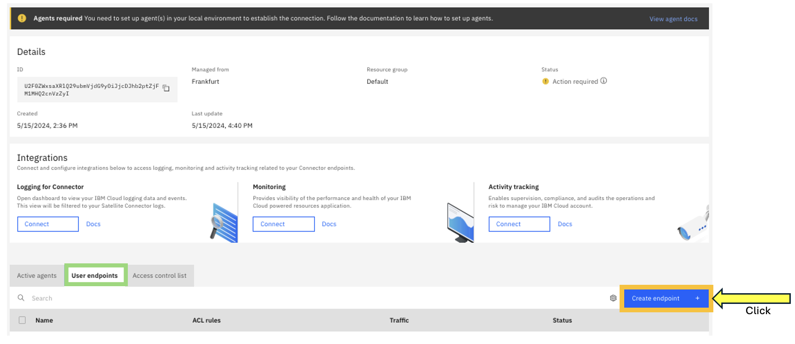

- Input your user endpoint parameters
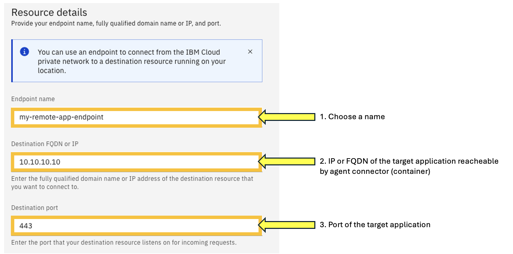

- Click Next
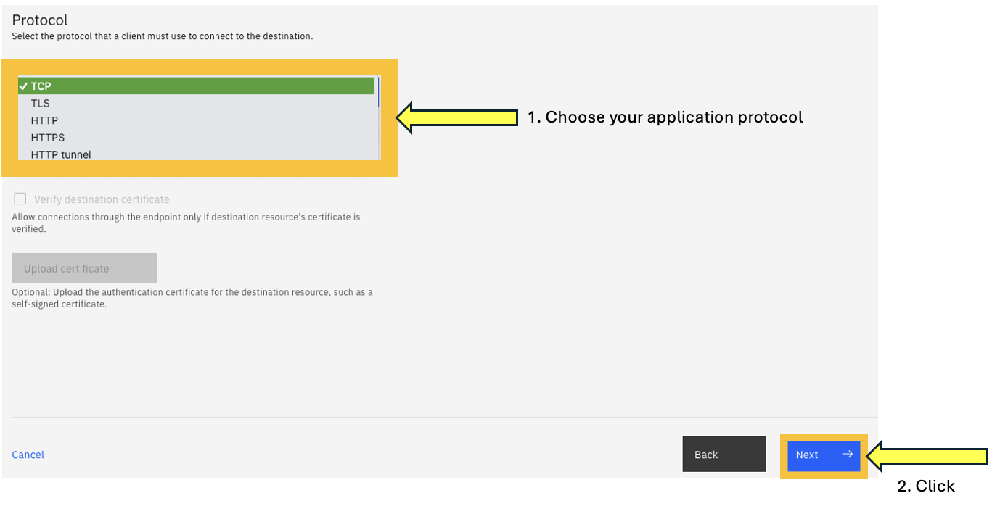

- You need to create a rule in order to narrow down the list of source IPs
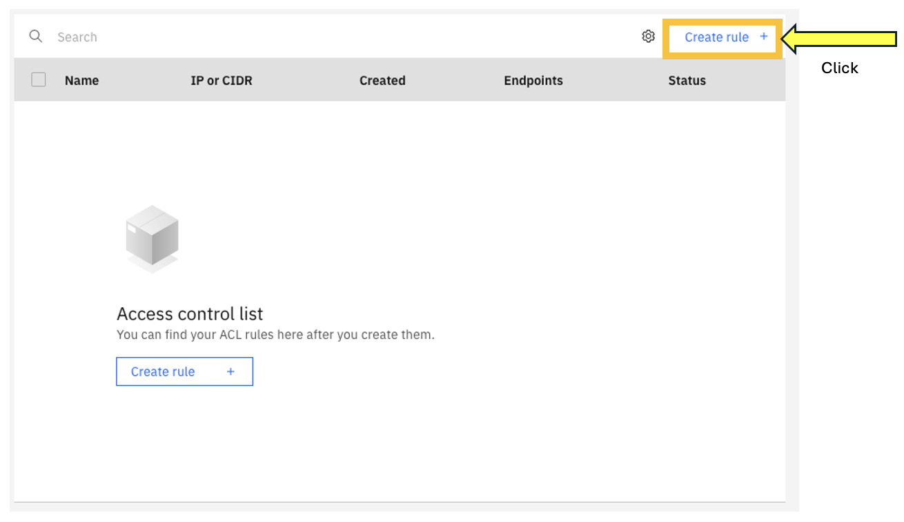

### How to get your source application IP ?
- If the source is coming from a server in the classic infrastructure, then provides the IP of the server (usually 10.x.x.x)
- If the source is coming from a resource in a VPC.
Go to your VPC at the console level and find the following details :
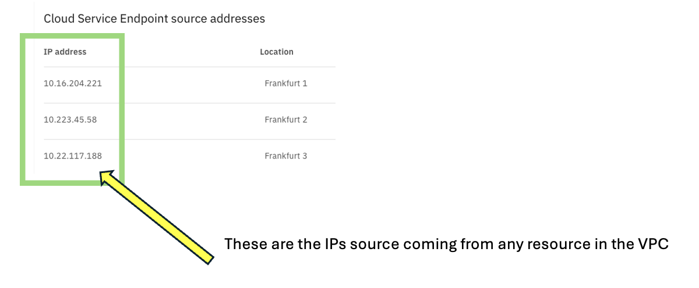
- If the source is coming an aaS service, it should probably in one of the following subnets : 161.26.0.0./16 and 166.8.0.0/14

If you need to be more specfic, then you can look at the logs in the container and you will see the specific source IP.

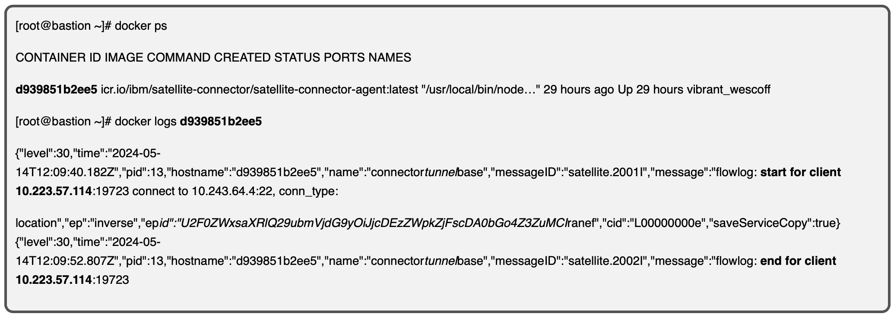

You will see your source IP, when searching the sequence '**start for client**' or '**end for client**' as shown above in **bold**.

Use also the following command for instance to retrieve all the source addresses :

___docker logs d939851b2ee5 | grep "start for client" | awk '{print $5}' | sed "s/:.*//" | sort -u___

You are now ready to use the Endpoint you just created, which is generated by Satellite.

So far, we are done !!! Congratulations

## Usecases
### Usecase 1 : Use IBM Cloud Satellite Connector to secure your API call from your **APIC Reserved Instance on IBM Cloud**

- Connecting APIC Reserved Instance to an IBM Cloud account
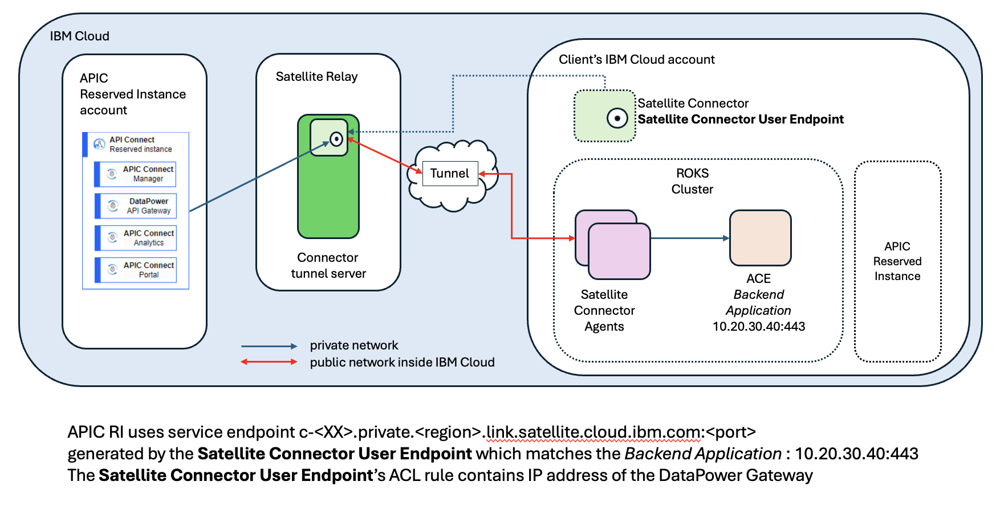

Here are the steps to setup this architecture :

#### On Client's IBM account site : 

- Create a Satellite Connector (it creates resources at the Satellite Relay level)
- Create a Satellite Connector Agent (it creates the secure tunnel between the Satellite Connector agent and the Satellite Connector resources)
- Create a Satellite Connector User Endpoint (it points to the local backend application, from the Satellite Relay)
- Use Satellite Connector User Endpoint ACL to whitelist the right IPs coming from your APIC Reserved Instance

#### On APIC Reserved Instance account :

- Use the endpoint provided by the user endpoint to connect to the backend resource

### Usecase 2
TBC

