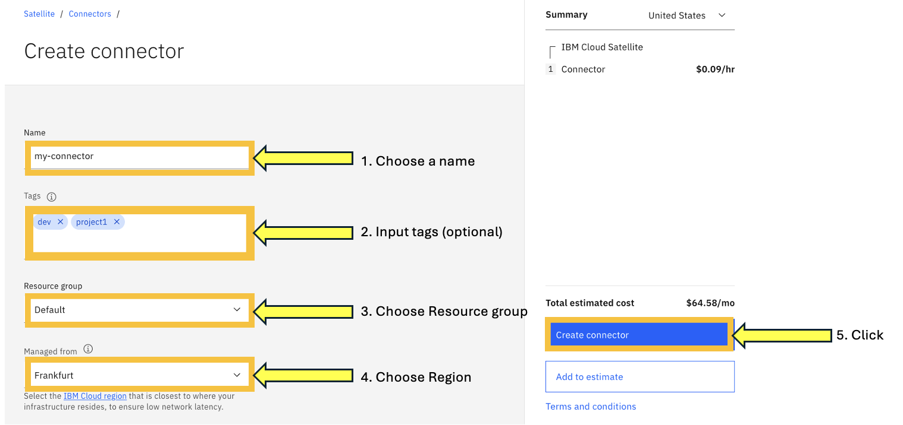
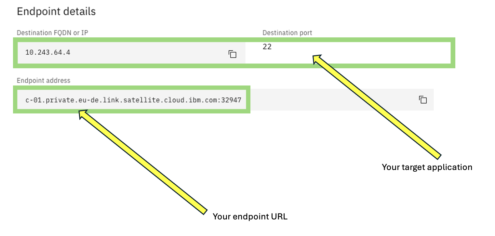
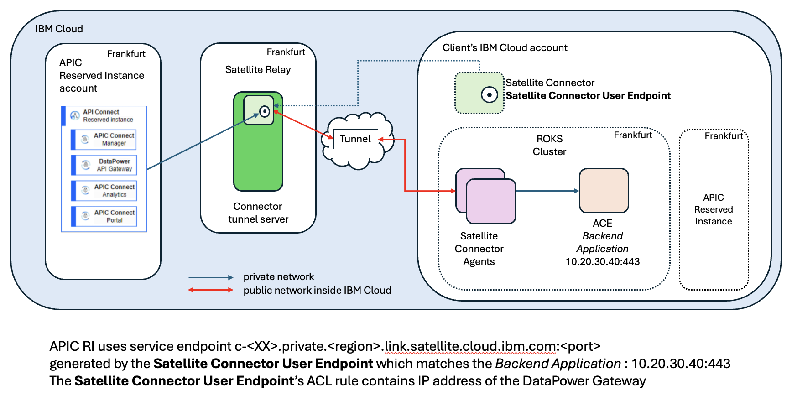

# Secure your connection with IBM Cloud Satellite Connector

## What is IBM Cloud Satellite Connector ?

A Satellite Connector is a deployment model that enables the secure communications from IBM Cloud to on-prem resources with a light-weight container that is deployed on your container platform hosts, such as Docker hosts.

All details regarding IBM Cloud Satellite architecture can be found [here](https://cloud.ibm.com/docs/satellite?topic=satellite-understand-connectors) .

## General architecture

The key thing is that any IBM Cloud account with VRF and Service Endpoint enabled may reach all cloud service endpoints exposed by any IBM cloud service, especially those which are exposed by the Satellite Relay.

The Satellite Connector Agent is a simple docker image, which may be deployed by the client anywhere, on a docker based platform (docker, k8s, openshift, ...), is a kind of reverse ssh tunnel.

The Satellite Connector Agent prerequisites are :
- internet access
- access to the target backend application

When the Satellite Connector agent is configured and deployed correctly, it creates a secure tunnel (called a connector) to the Satellite Relay on IBM Cloud.

You may then create a Satellite Connector User Endpoint, which generates a new cloud service endpoint port which is reacheable by default by all IBM Cloud resources in any IBM Cloud account. This particular endpoint is related to a single Satellite Connector Agent deployed and enabled. This latter has the IP or FQDN and port number to target a specific backend application.

In order to secure the access of the cloud service endpoint from a particular client, you may setup an access control list to allow only specific client applications

## Create a Satellite Connector using the IBM Cloud console
Access to the menu Connector menu

Create the connector

- Click 'Create connector'

- Input the connector parameters

- Check that your connector is up and running

## Create the Satellite Connector Agent 

- The connector agent is not a resource being provisioned at the console level.
- See documentation [here](https://cloud.ibm.com/docs/satellite?topic=satellite-run-agent-locally&interface=ui).

When the container is running at the client site and correctly setup with the right parameters, especially :

- SATELLITE\_CONNECTOR\_ID : ID of the connector shown previously

- SATELLITE\_CONNECTOR_IAM\_APIKEY : APIKEY available in order to give the ability to the connector to connect to the client's IBM Cloud account

- SATELLITE\_CONNECTOR\_TAGS (optional) : this tag will appear at the console level

the agent will appear at the console level

Note that the tag will appear accordingly in order to recognize the right agent

## Create the Satellite Connector User Endpoints

- The user endpoint will appear at all IBM cloud accounts with VRF and Service Endpoint option enabled, you need to input some parameters :

- Input your user endpoint parameters

- Click Next

- You need to create a rule in order to narrow down the list of source IPs

### How to get your source application IP ?
- If the source is coming from a server in the classic infrastructure, then provides the IP of the server (usually 10.x.x.x)
- If the source is coming from a resource in a VPC.
Go to your VPC at the console level and find the following details :

- If the source is coming an aaS service, it should probably in one of the following subnets : 161.26.0.0./16 and 166.8.0.0/14

If you need to be more specfic, then you can look at the logs in the container and you will see the specific source IP.

<html lang="en">
  <head>
    <meta charset="UTF-8" />
    <meta name="viewport" content="width=device-width, initial-scale=1.0" />
    <title>Page Title</title>
    
  </head>
  <body>
    <!-- This is the markup of your box, in simpler terms the content structure. -->
    

[root@bastion ~]# docker ps

CONTAINER ID   IMAGE COMMAND                  CREATED        STATUS        PORTS     NAMES

**d939851b2ee5**   icr.io/ibm/satellite-connector/satellite-connector-agent:latest   "/usr/local/bin/node…"   29 hours ago   Up 29 hours             vibrant_wescoff

[root@bastion ~]# docker logs **d939851b2ee5**

{"level":30,"time":"2024-05-14T12:09:40.182Z","pid":13,"hostname":"d939851b2ee5","name":"connector_tunnel_base","messageID":"satellite.2001I","message":"flowlog: **start for client 10.223.57.114**:19723 connect to 10.243.64.4:22, conn_type: 

location","ep":"inverse","ep_id":"U2F0ZWxsaXRlQ29ubmVjdG9yOiJjcDEzZWpkZjFscDA0bGo4Z3ZuMCI_ranef","cid":"L00000000e","saveServiceCopy":true}
{"level":30,"time":"2024-05-14T12:09:52.807Z","pid":13,"hostname":"d939851b2ee5","name":"connector_tunnel_base","messageID":"satellite.2002I","message":"flowlog: **end for client 10.223.57.114**:19723
    

  </body>
</html>

You will see your source IP, when searching the sequence 'start for client' or 'end for client' as shown above in **bold**.

You are now ready to use the Endpoint you just created, which is generated by Satellite.

So far, we are done !!! Congratulations

## Usecases
### Usecase 1

- Connecting APIC Reserved Instance to an IBM Cloud account

Here are the steps to setup this architecture :

#### On Client's IBM account site : 

- Create a Satellite Connector
- Create a Satellite Connector Agent
- Create a Satellite Connector User Endpoint

#### On APIC Reserved Instance account :

- Use the endpoint provided by the user endpoint to connect to the backend resource

### Usecase 2
TBC

