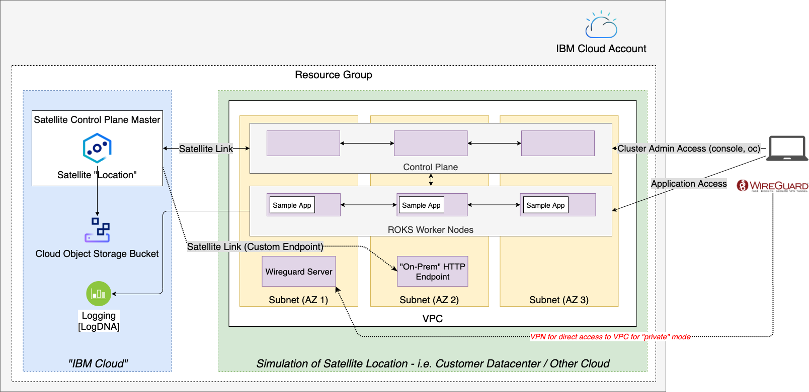

# try-sat

This set of scripts provides a mostly-automated way to set up a Satellite location and RedHat OpenShift cluster on IBM Cloud VPC Gen2 infrastructure, with a very simple sample app and built-in Satellite Link endpoint test.
This is not a model we would ever deploy for a real-world workload, but is useful for learning/experimenting/understanding.

## What Does try-sat Create?

* A dedicated Resource Group.
* A VPC (Gen 2) on IBM Cloud.
* 8 VSIs with RHEL v7: 3 Control Planes + 3 Worker Nodes + 1 Wireguard VPN server + 1 'on-prem' Satellite Link testing server, across three zones in the same VPC region.
* A Satellite location, with the 3 control plane VSIs attached.
* An 'on-prem' (network-adjacent to location) testing server which exposes a simple HTTP endpoint.
* *Optional*:
    * A ROKS cluster on the location, with the 3 VSIs assigned as worker nodes.
    * A LogDNA instance attached to the cluster ([currently broken](https://github.ibm.com/garage-satellite-guild/try-sat/issues/80)).
    * [A very simple sample app/container](https://hub.docker.com/r/nginxdemos/hello/) deployed to the cluster.
    * A Satellite Link Location endpoint configured to connect to the 'on-prem' simple HTTP endpoint.

## How to Use

*   Clone this repository locally.
*   Copy `.envrc-template` to `.envrc` (at the root of this repo), then follow the instructions in `.envrc` to edit it and set `try-sat` configuration.
*   Run `source .envrc` before you continue (you will need to re-run this in each terminal you open whenever you run `try-sat` commands; you can use [direnv](PREREQS.md) to automate this).
*   Install the [pre-requisite tools](PREREQS.md). You may already have many of these.
*   Complete one of the methods listed below.

### Method 1: 'One-click' Private ROKS cluster on private endpoints, with WireGuard VPN

> Estimated time: 90mins

1.  Run `make all_private`, or `make all_private_location` to just create the location without the ROKS cluster (this can be added later by running `make all_private_cluster`).

2.  If you create the location, and you want to add LogDNA log forwarding from your cluster, you must first [activate the WireGuard VPN](#using-your-generated-cluster), then running `make configure_cluster_logdna`.

### Method 2: 'One-click' Public ROKS cluster on public endpoints, with WireGuard VPN in addition

> Estimated time: 90mins

Run `make all_public`, or `make all_public_location` to just create the location without the ROKS cluster (this can be added later by running `make all_public_cluster`).

### Method 3: Hands-on Step-by-step

**For now this method is deprecated, but if you wish you can likely figure this out from the `all_private` or `all_public` targets in the [Makefile](Makefile).**

## What Next? / Using Your Generated Cluster

*   If you are using Method 1 (private endpoints), open the WireGuard client and import the generated WireGuard configuration file from the root of the checkout directory (`wireguard-$(RESOURCE_PREFIX).conf`). Activate the VPN.

*   Run `make login_cluster`. You should then be able to run `oc` commands and work with your new cluster from the command line using `kubectl`/`oc`.  Or... open the OpenShift console through the IBM Cloud console.

*   If you want to deploy a sample app, run `make deploy_sample_app`. It should deploy the sample app and print out the route you can access it on. NOTE: If you access the OpenShift console first, you may find your browser refuses to use the plain HTTP route for this app because of HSTS. You should still be able to access it using e.g. `wget` or `curl`.

*   If you want to connect to the 'on-prem' (network adjacent to Satellite location) HTTP endpoint in order to test Satellite Link, run `make create_sat_link_endpoint`. It will make the endpoint and print out the endpoint you need to connect to. *This endpoint - because of the way Satellite Link works - will only be accessible from the IBM Cloud private network*. You can connect to it easily by activating the WireGuard VPN (even if you are using the Public method).

### Using Logging Consoles

There are a variety of different logging consoles available for a Satellite location and ROKS cluster. [The documentation covers this in detail](https://cloud.ibm.com/docs/satellite?topic=satellite-health), but in summary:

| Level at which logger operates | Service Name                  | Restrictions                                                                                                                                                             | Automatically configured by `try-sat`?                                                                                                                                                                    | What does it show?                                                           |
| -                              | -                             | -                                                                                                                                                                        | -                                                                                                                                                                                                         | -                                                                            |
| Location                       | IBM Log Analysis (LogDNA)     | Must be in the same region as location is managed from, [marked as 'platform-level' logger](https://cloud.ibm.com/docs/log-analysis?topic=log-analysis-config_svc_logs). | No - must be [created manually](https://cloud.ibm.com/docs/satellite?topic=satellite-health#setup-la), as it is not specific to a Satellite location or cluster but is per-IBM Cloud account, per-region. | Satellite location errors, resource deployment status, Satellite Link status | (
| Location                       | IBM Activity Tracker (LogDNA) | Must be in the same region as location is managed from.                                                                                                                  | No - must be [created manually](https://cloud.ibm.com/docs/satellite?topic=satellite-health#setup-at), as it is not specific to a Satellite location or cluster. | Developer-level Satellite management events (not very helpful)               |
| ROKS Cluster                   | IBM Log Analysis (LogDNA)     | None.                                                                                                                                                                    | Yes (although [currently broken](https://github.ibm.com/garage-satellite-guild/try-sat/issues/80)), using `make configure_cluster_logdna` target.                                                         | All logs for ROKS cluster (equivalent to a ROKS cluster *not* on Satellite)  |

## Removing All Generated Resources

*   Run `make clean`

> **IMPORTANT NOTE**: If you destroy your location using `make clean` (or other methods), you may get quite a lot of random timeouts in the automation when you then to try recreate your setup again. For now, recommend using a fresh `RESOURCE_PREFIX` in `.envrc` each time you destroy an environment and re-run. This appears to be an issue with Satellite (see [here](https://github.ibm.com/alchemy-containers/satellite-planning/issues/1337) for issue and [here](https://ibm-garage.slack.com/archives/C01149RMSCU/p1614795537486000) for Slack discussion thread).

> Sometimes you may find that `try-sat` is [unable to delete your Resource Group](https://github.ibm.com/garage-satellite-guild/try-sat/issues/95). This appears to be because of resources that need to get cleaned up, and appears to be an IBM Cloud issue. Please wait a while, then try to manually delete your Resource Group.

## Troubleshooting

*   For all of the provisioning methods, you may see quite a few "error" messages as `try-sat` proceeds, such as `Registering a subdomain for control plane hosts...  FAILED. The specified location could not be found`. While this is not by design, [it is to be expected](https://github.ibm.com/garage-satellite-guild/try-sat/issues/47), as there is no other reliable way to detect certain creation events than to poll the CLI repeatedly until artifacts are created. Do not be alarmed if you see a number of these.

*   If you are trying to debug `try-sat`, you may want to run `make watch` (in a spare terminal window). This will help you watch the status of various key resources as they are created and will give a greater understanding of what's going on. Note that many errors will show in the early stages of creation - this is to be expected as resources won't exist yet.

*   If you want to record all the terminal output of `try-sat`, you might find [script](https://en.wikipedia.org/wiki/Script_(Unix)) helpful.

## Contacts

If you want to discuss try-sat, try the [try-sat-friends](https://ibm-garage.slack.com/archives/C01PCPAB9HS) Slack channel.
If you're thinking about using it for anything important, please read the [disclaimers and limitations](DISCLAIMERS.md)! Also, there are some [known issues](https://github.ibm.com/garage-satellite-guild/try-sat/issues?q=is%3Aissue+is%3Aopen+label%3Abug).

## Thanks

* Jake Kitchener's walkthrough videos [1](https://ibm.ent.box.com/s/c2p4bi1mxfo3xf5s8mi3u6fagz2f87mm), [2](https://ibm.ent.box.com/s/l5cebiychfcm72hbthrv6cpxetevhmbc) were very helpful in putting this together, although we've taken a slightly different approach here in places.

* John Pape for a lot of help on Slack.

* Ilene Seeleman and the Security Guild for [Terraform-izing WireGuard](https://github.ibm.com/ibm-garage-for-cloud/guild-automation-scripts).

* Chris Weber for the new project name!

* Frederic Lavigne for doing some testing and sending a pull request with lots of improvements.

* Raimond van Stijn for fixing the region issue so any region can be used.

* Lionel Mace for some detailed feedback on UX of `try-sat`.

* Horst Josef Grenz Meza for some feedback on `try-sat`.

